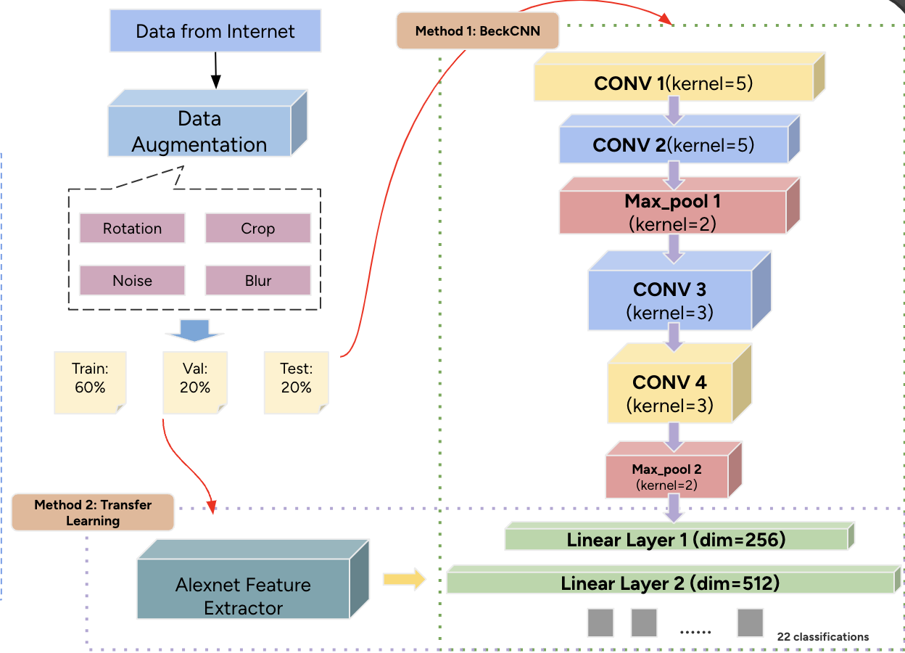
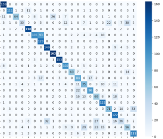
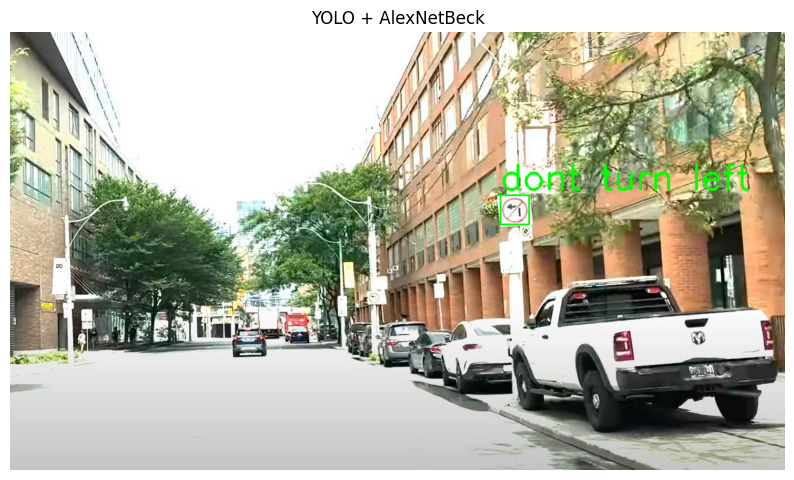

# Traffic Sign Recognition System (YOLOv8 + CNN/AlexNet)

A deep learning–based traffic sign detection & classification system using YOLOv8 and CNN/AlexNet models.

---

## Overview
This project builds a two-stage traffic sign recognition pipeline combining:

- YOLOv8 for traffic sign detection
- CNN / AlexNet for sign classification (22 classes)

Designed for autonomous driving research, the system detects signs in real-world scenes and classifies them with high accuracy.

---

## Model Architecture

<p align="center">
  
</p>

The pipeline includes:

- Data Augmentation (rotation, crop, blur, noise)
- Two classification approaches  
  - Custom 4-layer CNN  
  - AlexNet transfer learning  
- End-to-end YOLO → Crop → Classify workflow

---

## Dataset & Augmentation

- 22 traffic sign categories  
- Augmentation includes crop, rotation, blur, noise  
- Train/Val/Test split: 60% / 20% / 20%

---

## Methods

### 1. YOLOv8 Detection
Detects traffic signs from road scenes and outputs cropped sign regions.

<p align="center">
  
</p>

---

### 2. Classification Models

#### Method 1 — Custom CNN
- 4 convolutional blocks  
- 2 MLP classifier layers  
- ~75% accuracy  

#### Method 2 — AlexNet Transfer Learning
- Pretrained backbone  
- Fine-tuned final layers  
- ~82% accuracy  
- Used in final pipeline  

---

## Results

### Confusion Matrix
<p align="center">
  
</p>

---

### End-to-End Pipeline Output
<p align="center">
  
</p>

---

## Demo Video

 [Click to watch demo](demo/final_video_pre.mp4)

(Upload your mp4 file under `demo/` so this link works.)

---

## Project Structure

```plaintext
traffic-sign-recognition/
├── data/                     # Dataset (traffic signs)
├── images/                   # Images used in README
│   ├── pipeline.png
│   ├── aug_cropped.png
│   ├── confusion_matrix.png
│   ├── yolo_inference.png
├── demo/
│   └── final_video_pre.mp4   # Demo video
├── src/
│   ├── train_cnn.py          # Custom CNN training
│   ├── train_alexnet.py      # AlexNet fine-tuning
│   ├── yolo_detect.py        # YOLOv8 detection
│   └── pipeline_inference.py # End-to-end pipeline
└── README.md
```
